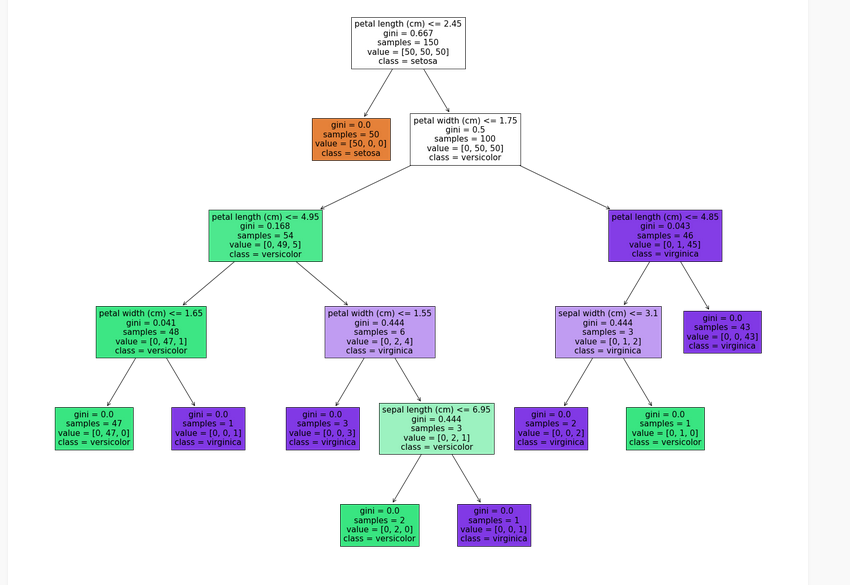
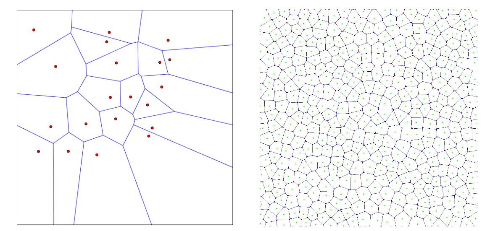
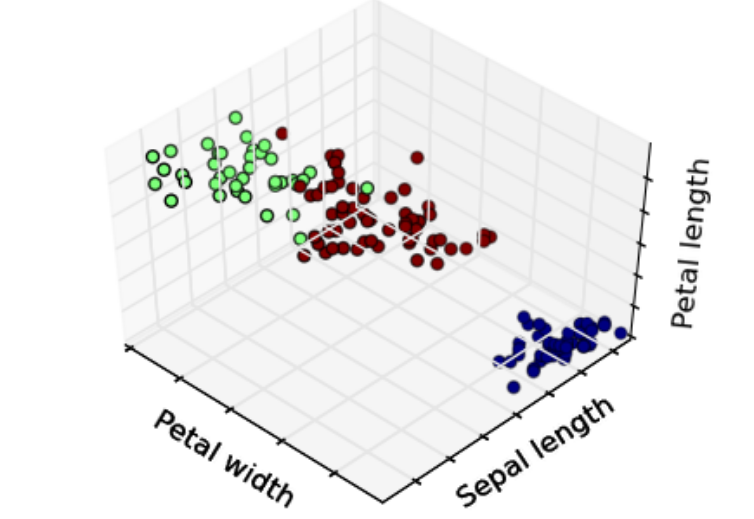

# Midterm Overview
This repo is my studying resource where I attempt to code everything in the lectures to understand them.
It has worked for me in the past so I'm going to try again.

## ML Algorithms

This section will go over all of the ml algorithms coded from scratch.

### Decision Trees

Located in the `/dtrees` folder, is the algorithm for decision trees.

The above visualization demonstrates how the algorithm works at a high level.
Each node that is not a leaf node has a **split condition**.
These split conditions split the data set on a single feature based on a single bound.
These splits are deteremined using the **information gain ratio**(IGR).
To define IGR we first need to define **entropy** which is,
```math
    H(x) := -\sum_{x\in X} p(x) \log(p(x))\\
    = E[\log(p(x))]
```
Where, $p(x)$ is the probability of an event $x$ happening and $E[x]$ is the expected value of x.
The entropy tells us how random a set of data is.
An $H[x] = 0$ tells us there is no randomness, i.e only one event exists in the set of points.
We can see that if there is only one event in the set $X$ that event will have a $p(x) = 1$ which will $\log(1) = 0$ thus having an entropy of 0.

### k-Nearest Neighbors (kNN)

One of the simpler algorithms, the nearest neighbor algorithm will classify the points based on the point it is closest to in the dataset.

Below depicts a $k=1$ nearest neighbor algorithm visualized.

As we can see, the regions around each determine which points will share that label based on the other point's location.
A little confusing but the idea here is that **a point is classified based on the closest point(when $k=1$).**

When $k>1$ we actually determine class based on the k nearest points.
For example, if $k=2$ we look at the 2 closest points and determin the label by the class that occurs the most frequently.
As you may have infered, ties can occur.
To solve this problem use an odd number for $k$ this solution will only work if there are only two classes.
If there are more than two classes than a tie can still occur.
Usually, if there is a tie, default to the closest point.
If there is still a tie, randomly pick one of the points to decide a label.
A formal description for what I am talking about is below:
```math
\hat{y} = \argmin_{y\in Y}\sum_{i=1}^{k}1(y = y^i)
```
Excuse the lack of an indicator function, I do not know how to write it in markup.
However, the equation above formalizes the idea of prediction.

Standardization is another topic that can be applied to multiple algorithms here but the lecture slides introduce the concept when discussing kNN.
To discuss the process, we first need to formalize the standard deviation and mean.
**Mean**
```math
    \mu_a = \frac{1}{n}\sum_{i=1}^{n}x_a^i
```
**Standard Deviation**
```math
    \sigma_a = (\frac{1}{n}\sum_{i=1}^{n}(x_a^i - \mu_a)^2)^{\frac{1}{2}}
```
Above is explicitly in the notes, however I do believe the $\mu_a$ is supposed to be $\mu_a$.
In the notes the original definition defines it as $\mu_i$ which doesn't make any sense.
That would imply that there are multiple means, or a single mean per point.

The standardization formalization can now be written as.
$$
\hat{x}_a^j = \frac{x_a^j - \mu_a}{\sigma_a} 
$$
I implemented standardization in the file `utilities/standardization.py`.
I show that the sklearn standardization is gets the same result as my simple implementation.

## Concepts

#### Unsupervised Learning
This is the idea that a dataset does not have any labels for its training data.
There are less formalities with this type of machine learning.
I don't know if that is applied through the entire study but this lecutre does not take equal amount of time to define this type of learning.

##### Setup

Given:
$$
\{x^1,x^2,...,x^n\}
$$
The **goal** is to discover interesting regularities/structures/patterns that characterize the instances.
For example, clustering, anomoly detection, and dimensionality reduction all fall under unsupervised learning.
To paraphrase a bit, unsupervised learning is designed for pattern identification with a lack of labels.

##### Clustering

The goal for clustering is to model *h* such that it divides training set into clusters with intra-cluster similarity amd inter-cluster dissimilarity.
To paraphrase again, the goal is to group *close* points and separate *far* points.
You may be asking yourself, how do you define distance for points where there is no clear definition of distnace?
Well, there are many ways, one can project points with no sense of distances into a space where distance is defined.
Or as my professor put it, just don't use the clusering algorithms.



Above is a visualization of the concepts discussed. 


##### Anomaly Detection

The goal of anomaly detection is to detect anomalies.
Yes I know riviting.
But this problem is actually harder than it sounds.
Although simple to define what the goal is, defining what an anomoly is depends completely on the space you are working in.
An anomaly for a signal processing problem will look completely different than a computer vision anomaly.
Defining the anomaly to a computer is the most difficult component.

##### Dimensionality Reduction

The goal for dimensionality reduction is to find patterns in lower dimensional feature vectors.
In other words to detect correlations between lower dimensions within the dataset.
This concept again is harder than it sounds.
A easy example for those who know about it is **PCA** or Principal Component Analysis.
PCA defines what deminsions have the most information about the data.
I do not want to get into the definition here as this is a high level overview but the point is that it accomplishes the goal of dimensionality reduction which is find lower dimensional patterns within a dataset.


#### Supervised Learning
This is the idea that a machine learning model is trained on data that has labels.
This is the primary focus of the first lecture.
We will formalize this concept below.
Let us say there is a set of all possible instances $X$, we want to find a function $f:X\rArr Y$ where $Y$ is the label space.
When I write, $f:X\rArr Y$ it means to map a set $X$ to a set $Y$.
To simplify this idea further, it means to find a function that maps one variable to the other.
The final component of the problem statement is the set of all possible mappings $H = \{h|h:X\rArr Y\}$.
Again this reads more complicated than it is, it is an abstract representation of all possible models.
The goal is to find an $h$ that best approximate $f$ using the labeled dataset.
Let us give examples of each problem component, for a **binary classification** problem, $Y=\{-1,1\}$.
$X$, on the other hand, can honestly be whatever but for example sake, we say that $X=\{1,2,3,4\}$.
$f$ will take $X$ and $Y$ and attempt to create a mapping that matches all known information.
So, $f=\{(1,1),(2,-1),(3,1),(4,-1)\}$ is a mapping. 

$X$ can also have multiple features per point rather than a single value.
In this case, $x\in X$ are **feature vectors**.
$Y$ can also have more than two possibilities, we can think of cases where $Y$ has multiple cases as $Y$ has multiple **classes**.

##### Classification Vs. Regression

Classification extracts labels from a finite set of possiblities.
Regression, on the other hand, can have an infinite number of possible outputs.
Classification's goal is to determine a point's class where as the goal of regression is to map a set of points to a continouous function.

##### Hypothesis Class

We discussed earlier that $H$ is the all possible $f$s for a given $X$ and $Y$.
However, as one may assume, that can be --and likely is-- infinite.
What people do is they pick a subclass of and attempt to work within that smaller region.
This subclass may still be infinite but due to the restriction on the type of function we are allowed within the subclass it makes finding said function easier.

Let $h_{\theta}(x) = \sum_{\theta_i \in h_{\theta}}{\theta_i x_i} $, $h_{\theta}$ is a linear subclass of the hypothesis class.
$h_{\theta}$ is simplier because we can control the amount of parameters and nothing special is applied to $x$.
$\theta_i$ is a weight and $x_i$ is a feature. 

##### Types of Training

There are two types of learning defined in the lectures.
1. Batch Learning
2. Online Learning

**Batch Learning** trains over all instances at once.
Whereas, **Online Learning** trains the model on a specific group then updates are gotten per group.

The general idea behind these two concepts says that both methods for training work.
I am a bit confused as to why the separation is important but I digress.

##### Goal of Supervised Learning

Goal: **Find a model $h$ that best approximates $f$**
To find $f$ we have to work with a minimization problem:

```math
\hat{f} = \argmin_{h \in H} \frac{1}{n} \sum_{i=1}^{n}l(h(x^i),y^i)
```

$\hat{f}$ is known as **Empirical risk minimization**(ERM).

$l$ is a new symbol we have yet to define, $l$ is what we call a loss function.
Let us now describe what $\hat{f}$ really means.
We want to find $h$ such that the sum over all points $l$ is super small. 
The smaller that sum over $l$ is, the better the selected model is.
Intuitively this makes sense, the total error being low does imply that the model is the best.


