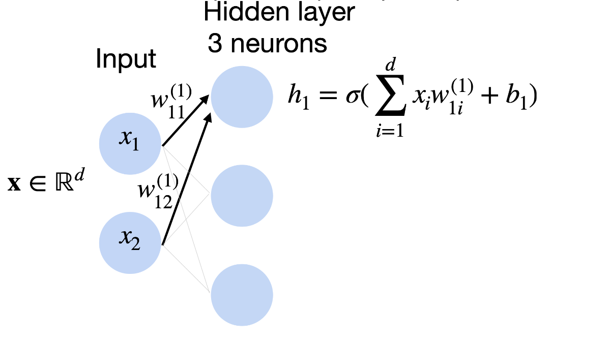
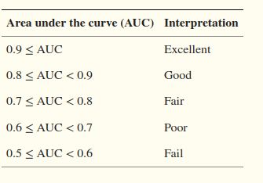

# Midterm Overview
This repo is my studying resource where I attempt to code everything in the lectures to understand them.
It has worked for me in the past so I'm going to try again.

## ML Algorithms

This section will go over all of the ml algorithms coded from scratch.

### Decision Trees

Located in the `/dtrees` folder, is the algorithm for decision trees.

The above visualization demonstrates how the algorithm works at a high level.
Each node that is not a leaf node has a **split condition**.
These split conditions split the data set on a single feature based on a single bound.
These splits are determined using the **information gain ratio**(IGR).
To define IGR we first need to define **entropy** which is,
```math
    H(x) := -\sum_{x\in X} p(x) \log_2(p(x))\\
    = E[\log_2(p(x))]
```
Where, $p(x)$ is the probability of an event $x$ happening and $E[x]$ is the expected value of x.
The entropy tells us how random a set of data is.
An $H[x] = 0$ tells us there is no randomness, i.e only one event exists in the set of points.
We can see that if there is only one event in the set $X$ that event will have a $p(x) = 1$ which will $\log(1) = 0$ thus having an entropy of 0.
The information gain(IG) can now be defined below.
```math
    IG(Y,X) = H(Y) - H(Y|X)
```
So what this is saying intuitively is IG is the difference between the entropy of the even occurring over the data set and the entropy of the event happening when another event occurs.
Lets work through this example below,

First we calculate, 
```math
    H(Y) = -\sum_{x\in Y} p(x) \log(p(x))\\
    = (0.5(\log(0.5))) + (0.25(\log(0.25))) + (0.125(\log(0.125))) + (0.125(\log(0.125))) \\
    = 1.75
```
Next we calculate,
```math
    H(Y|X) = -\sum_{x\in X}\sum_{y\in Y} p(x,y) \log(p(y|x))\\
    = 1.5
```
I wrote code in `utilities/entropy` calculating the results.
I just want to make a few notes, the notation does not account for conditional probability situations.
This again, is very annoying because the **conditional entropy is defined differently than regular entropy.**
As we can see from the equations above.
To get the result you have to apply Bayes rule to redefine the conditional within the log to be a product of the joint probabilities divided by the probability of $x$.

We can now finally define the IGR we discussed earlier.
```math
    IGR(X,Y) = \frac{IG(X,Y)}{H(Y)} 
```
Finally we have a formal definition of IGR. 


Now that we have IGR we can walk through the decision tree algorithm.
The candidate splits are determined by the highest IGR when selecting a point to be conditioned over.
The stopping criteria will be when the IGR is zero or when the set of training instances is empty.
A leaf node will delegate a label once a testing sample is ran through the dtree.
Finding the best split is just using the maximal IGR we determined from when making $C$.
Once $C$ has been determined, we branch off into subsets.
If there are only two classes, then there will only be two subsets.
Each subset will get a node and the algorithm will be called recursively.
For an implementation example, see `dtrees/decision_trees.py`.

For the final note on dtrees, let us describe the inductive bias.
The **hypothesis space bias** is the decision tree algorithms favor trees with single features, axis parallel splits.
What this means is that the algorithm will tend toward designing models that are focused in a single dimension and place splits in parallel.
We can think about it as Dtrees are tend towards dividing up spaces with straight lines through where the lines are defined only in a single dimension.
The **preference bias** is indicative of small trees identified by greedy search.
This means that the dtree algorithm will tend to try and make smaller trees with the greedy search algorithm.


### k-Nearest Neighbors (kNN)

One of the simpler algorithms, the nearest neighbor algorithm will classify the points based on the point it is closest to in the dataset.

Below depicts a $k=1$ nearest neighbor algorithm visualized.

As we can see, the regions around each determine which points will share that label based on the other point's location.
A little confusing but the idea here is that **a point is classified based on the closest point(when $k=1$).**

When $k>1$ we actually determine class based on the k nearest points.
For example, if $k=2$ we look at the 2 closest points and determine the label by the class that occurs the most frequently.
As you may have inferred, ties can occur.
To solve this problem use an odd number for $k$ this solution will only work if there are only two classes.
If there are more than two classes than a tie can still occur.
Usually, if there is a tie, default to the closest point.
If there is still a tie, randomly pick one of the points to decide a label.
A formal description for what I am talking about is below:
```math
\hat{y} = \argmin_{y\in Y}\sum_{i=1}^{k}1(y = y^i)
```
Excuse the lack of an indicator function, I do not know how to write it in markup.
However, the equation above formalizes the idea of prediction.

Standardization is another topic that can be applied to multiple algorithms here but the lecture slides introduce the concept when discussing kNN.
To discuss the process, we first need to formalize the standard deviation and mean.
**Mean**
```math
    \mu_a = \frac{1}{n}\sum_{i=1}^{n}x_a^i
```
**Standard Deviation**
```math
    \sigma_a = (\frac{1}{n}\sum_{i=1}^{n}(x_a^i - \mu_a)^2)^{\frac{1}{2}}
```
Above is explicitly not in the notes, however I do believe the $\mu_a$ is supposed to be $\mu_a$.
In the notes the original definition defines it as $\mu_i$ which doesn't make any sense.
That would imply that there are multiple means, or a single mean per point.

The standardization formalization can now be written as.
$$
\hat{x}_a^j = \frac{x_a^j - \mu_a}{\sigma_a} 
$$
I implemented standardization in the file `utilities/standardization.py`.
I show that the sklearn standardization is gets the same result as my simple implementation.

I implemented a basic kNN algorithm in the file `nearest_neighbors/nn_alg.py`.
I have not implemented fancy nearest neighbors yet.
I think I eventually will.

There still remains the question, **How do you deal with irrelevant features?**

Above is an example of how irrelevant features can affect the distances.
This is just a problem with kNN models in general.
They are weak to irrelevant features.

**Strengths**
1. Easy to explain predictions
2. Simple to implement
3. No training
4. Often a good solution in practice

**Weaknesses**
1. Sensitive to irrelevant features (see image above)
2. Prediction stage can be expensive
3. No "model" to interpret 

The **Inductive Bias** is defined as assumptions a learner uses to predict a label $y$ for a previously unseen instance $x_i$.
There are two components that make up inductive bias: **hypothesis space bias** and **preference bias**.
**Preference Bias** specifies a preference ordering within the space of models.
**Hypothesis Space Bias** determines the models that can be represented.
These definitions at face value are not good.
To simplify these abstract definitions, inductive bias is a set of assumptions that a machine learning algorithm makes about the relationship between the input and output data based on the training data.
Our preference bias is then defined by the neighborhoods seen in training data.
ChatGPT gave me a great example to explain this intuitively.
Imagine training a classifier based on movie recommendations, if I prefer action movies, my training data will have a preference bias towards action movies.
Therefore, someone who does not enjoy action movies will have a less accurate rating prediction than me.
Hypothesis classes are actually a little easier to grasp.
Again, with the help of ChatGPT, a hypothesis class is more about boundary creation.
If a boundary is explicitly linear, then the kNN model will have trouble because kNN doesn't draw linear boundaries well.
Therefore, kNN models have a hypothesis bias.


### Linear Regression

Linear regression is the concept of finding a function $f$ that maps to a set of points and labels.

#### Setup

For the setup, I am going to be referencing the slide below.

We are given the usual setup, real-numbered training data with $d$ features, and labels to go with each point.
Whats new here is the loss function.
We can rewrite the above function as,
```math
    l(f_{\theta}) = \frac{1}{n}||X\theta -y ||^{2}_2
```
Where $X$ is a matrix whose rows represent each point in our dataset and $|| * ||^{2}_{2}$ is the $l_2$ norm.
To optimize this loss function, we need to take the gradient and solve for when the gradient is $0$.
The work for is below.


Notice how we can actually represent $\theta$ as an equation.
This formal definition means that training $\theta$ is simple.
However there is a caveat, **not all matrices are invertible**.
Meaning we have to account for the case when the matrix cannot be inverted.
This lack of inversion is actually more common then you may think.
Most datasets are actually not invertible by default meaning that it is more common to see the next forms of linear regression than the original.

##### Ridge Regression

The first regression type on our list is ridge regression.
Ridge regression has a loss function defined below.


When we solve for $\theta$ now we get,


Notice the $\lambda n I$ term.
All matrices are invertible when summed with the identity matrix.
The reasoning for why the previous sentence is true is not needed to understand ridge regression's purpose.
Because the matrix is invertible, $\theta$ will always exist.

The natural question then becomes, how should one pick $\lambda$?
Normally, you would pick $\lambda$ during the cross validation phase.
Algorithmically changing it so that it minimizes the loss function. 

Ridge regression's **main goal stated in the slides is actually to prevent large weights**.
Making the matrix invertible may be an after thought for these lectures, but always having a invertible matrix is a very important component of the ridge regression as well.

##### LASSO: The Weird Brother To Ridge Regression

LASSO looks very similar to ridge at first glance.
Equation below defines LASSO as,


The only difference is that we are now using the $l_1$ norm.
As I said earlier, at a glance there doesn't seem to be a big difference.
However, there is: **LASSO has no closed form solution**.
Which means that the gradient has many possible solutions.
We will discuss how to work with this later in this section.

The **goal** of LASSO is to encourage *sparse* solutions, meaning $\theta$ will contain more zeros.
With more zeros means more sparsity in the solutions to $f_{\theta}$.

##### Evaluating Linear Regression Models

There are several metrics we can look to when evaluating linear regression models.
We will start with **R-squared** which is defined as,

```math 
    R^2 = 1 - \frac{\sum_j (y^j - f_{\theta}(x^i))^2}{\sum_j(y^j - \bar{y})^2}
```

Where $\bar{y}$ is the empirical mean of the labels.
R-squared tells us how much variance in $y$ is predictable by $x$. 

The next is **MSE** which is mean squared error.
There is also **RMSE** which is the same thing as MSE except you just take the root of the MSE.
These tell us how far in euclidean space the predicted value is from the actual.

There is also the **MAE** which is the mean average error.
This tells us the average error over all predictions.
MAE will likely tell is the same thing as MSE but with out squaring the error first.

##### Gradient Descent for Linear Regression

We are finally discussing gradient descent.
Boy am I excited.
Below summarizes gradient descent quite well.


The goal is to optimize $g(\theta)$, as we saw earlier when dealing with ridge regression, we can take the gradient to optimize the parameters.
However, rather than just setting the equation equal to zero, gradient descent is an iterative method that goes until you say stop.
The general idea of gradient descent is to iteratively find a minimum without solving for zero.
There are several equations in machine learning that do not have a gradient that exists at zero.
Thus, the iterative method is the only way to minimize $g(\theta)$.
Gradient descent is one of the most widely adopted concepts in machine learning.
It opened the flood gates for several loss functions to be viable without needing the function to be continuos.
If that last sentence did not make sense, **continuous** means that the function exists for all points, and the function has a derivative at every point.
Below is the gradient descent equation for linear regression.


Gradient descent is actually faster.
Inverting a giant matrix is actually a very difficult task for a computer to do.
For example, inverting a square $m$ x $m$ has a complexity of $m^3$.
Gradient descent, on the other hand, has a complexity of $dnt$ where $d$ is number of features in $X$, $n$ is how many points there are, and $t$ is how many epochs or gradient descent iters you evaluate.
Thus, gradient descent is much faster on average especially for large datasets.

So what are the drawback of gradient descent(GD)?
There are a couple, to take the GD you need to have a **convex function**.
How do we define a convex function?
The figure below is a good starting point.


The above figure is a fancy way of saying that the function must have a local minima between two points.
The figure straight up says that you must be able to draw a line from $x_1$ to $x_2$ and all points of the function must be below that line.

### Logistic Regression

After a grueling time with the likelihood estimator, we can start discussing logistic regression.
If you are unfamiliar with the likelihood estimator, I would highly encourage you to read that section under concepts.
We define the logistic distribution as,


Which has a conditional distribution defined as,


We define the loss of the log likelihood estimation as 

$$
    log\;likelihood(\theta|x^i,y^i) = log(P_{\theta}(y^i,x^i))
$$

Thus, the optimization problem becomes,


So, with all of the above, whats the big deal with logistic regression?

1. It is bounded on $(0,1)$
2. Its symmetric, $1 - \sigma(z) = \sigma(-z)$
3. Its gradient is super easy, $\sigma^{`}(z) = \sigma(z)(1-\sigma(z))$

I included an example logistic regression file in `logistic_regression/lr.py`.


### Naive Bayes

Naive Bayes assumes that features are **conditionally independent**.
Let us define conditional independence before continuing.
Formally, let us say there are three probability distributions, $A$, $B$, and $C$.
$A$ and $B$ are conditionally independent if $P(A,B | C) = P(A|C)*P(B|C)$.
Intuitively, $C$'s existence "blocks" all influence between $A$ and $B$.

Below is a good visualization of Naive Bayes' overall model.


This one took awhile, there is a lot of details we need to discuss before continuing.
If you don't care about the details and just want some code, I wrote a naive bayes model from scratch in the file `naive_bayes/nb.py`.
Check that out and if you are still confused come back here.

Let me break down the picture above in a simpler way.
There is a huge difference between $P(X)$ and $p(x)$ where $X$ is a distribution and $x\in X$.
$P(X)$ is the probability mass function(PMS) of the distribution.
This is a very key component to understanding the code and what the hell this picture is saying.

We will walk through the image above using an example and explaining each component of the image.

**Example Problem**
We have an entire set of athletes $A$ and each athlete has the features (age,sex,height,weight) and a set of labels $Y$ that assigns each player a sport.
Our model is a naive bayes classifier $h(a)$ where $a\in A$ predicts what sport an athlete plays.

$P(X_k|Y)$ is saying, given $Y$ what is the probability distribution for the $k$th feature in $X$.
In simpler terms, it is saying what does each feature of $X$ look like for the class they are assigned too.
For example, lets look at $P(A_k|Y)$ where $Y=$ **basketball** and $k=$**height**, the likely height of a basketball player is likely a number over 6ft.
We do that for all classes and features for each point in our training set.

The actual formulation of the model requires us to understand one quick math rule $log(a*b) = log(a)+log(b)$.
With that rule in mine, if we apply log to the model, we get $\sum_{y\in Y}((P(y)) + \sum_{k=1}^K P(X_k|y))$.
This looks weird but we are just simplifying the equation in by applying log to the product.
Which is why the code looks the way that it does when you read it.

Training is easier than it sounds, all you have to do is find the likelihood of a value for each class for each feature.
We will list each step below:
1. Separate points by their label.
2. Calculate $P(Y) = \frac{|X_Y|}{|X|}$ where $X_Y$ are the sets of points divided up by label and $|X_Y|$ represents how many points are within that set. This value is the prior of $Y$.
3. Calculate the mean and variance for each feature within the class. See code for how to do this.

Great, we just trained the model!
The confusing part is the prediction methodology.
If you are unfamiliar with probability this part will be confusing.
It was for me and I took an advanced probability course.
You have been warned.
For our prediction algorithm we need to pick a distribution to base our PMF on.
If you don't know, use a Gaussian or normal distribution.
You can also do some likely hood estimates over multiple distributions to see which works the best but for simplicity I will be using a Gaussian distribution for the rest of the explanation.
The Gaussian PMF is defined below,
```math
    P(X) = \frac{e^{-\frac{(X-\mu)^2}{4*\sigma^2}} }{\sqrt{2\pi\sigma}}
```
Where $X$ is a normal distribution, $\sigma$ is the variance of $X$, and $\mu$ is the mean of $X$.
For more information about where that comes from you're going to need to have to find it somewhere else because I honestly don't have the time to go over the derivation it is not straight-forward.
If you trust me then we can move on.

With the PMF defined, predictions are as follows:
1. Find the likelihood of a label of a point by looking at the likelihood of each feature given the priors we computed earlier. Likelihood refers to calculating the PMF over each feature for the normal distribution.
2. Take the log of all results and some the results with the log of the prior.
3. After doing that for each class, find the class with the highest sum.
4. Return that class.

Please look at the python example for any questions.

There is one last concept we need to discuss and that is **smoothing**.
If you're smarter than me, you may have noticed this algorithm fails the training data is missing a class from the class list.
Referring back to our sports example, if we do not have any data for professional bowlers, then our model will not be able to classify athletes that bowl.
However, our model can account for what it doesn't know with smoothing.
If we add a constant to all priors of the classes we can still account for things we have not seen if we know they will show up.

### Perceptron Algorithm

We should start by just showing a picture of the first example.


$x_i$ where $i = 1,2,3,...d$ are the features of a single data point.
We can think of an input $x$ as having d dimensions and each dimension gets its own weight.
Above is a simple case where if the weights multiplied to the features is greater than or equal to 0 return 1 else return 0.
Perceptrons can only represent only **linearly separable** concepts.
What this means is that if you can draw a line dividing the classes, than the perceptron can work for your problem.
If you can't then the algorithm will not work.

#### Training

There a great image in the slides I am going to use here. 


Notice how with every point the line gets redrawn depending on the new point.
So how does this work formally?
An example algorithm is as follows:
```python
import numpy as np

def training(x,y,w):
    # Make w have as many zeros as x has features.
    w = np.zeros(len(x))

    #Iterate through each row of the dataset.
    for i in range(len(x.shape[0])):
        #If a classification is incorrect, shift the line based on the product of the label and the point.
        if y[i]@w.T@x[i,:] < 1:
            w = w + y[i]@x[i,:]
        else:
            
            continue
   
    return w
```
Assuming you have got all the matrices the correct size then this algorithm will work.
The above algorithm's loss function is called **hinge loss**.


As you can see, only incorrectly classified points will have an effect on the weights.

#### Mistake Bound

This one is odd, or at least the explanation can be hard to understand.
Let us walk through it.
First let us define $H_w = x$ when $w^{\top}x = 0$.
These are the hyperplanes where our learned function equals zero.
We can define the **margin** of our data to be $\gamma(S,w) = \min_{1\le i \le n} dist(x^i,H_w) = \frac{|x^{\top}w|}{||w||}$.
There is no indication, but I believe the $|| * ||$ is the magnitude of a vector.
I hope the math will clarify this distinction.
Which is equal to, $\gamma(S) = \max_{||w||=1} \gamma(S,w)$.
From what I can see, we only care about when $||w||=1$.
Plugging that 1 into the fraction above, we want to know the maximum of the minimums of of the above $x$ for each hyperplane.
We also want to say that the diameter of our mistake bound is $D(S) = \max_{x\in S} ||x||$.
With all these seemingly out of place equations, we can finally define the mistake bound.

The **mistake bound** is defined as
```math
    (2+D(S)^2)\gamma(S)^{-2}
```
So what is the intuitive understanding of the equation?
This equation says that the total amount of mistakes we can make for a perceptron is proportional to the size of the data($D(S)$) and inversely proportional to the closest misclassified point.
In other words, we can draw a circle that wraps the furthest misclassified point and the point with the largest distance magnitude away from the line.


### Neural Nets

Neural nets are built off of perceptrons in a nice way.
In a perceptron, the activation function was fixed.
Whereas in neural nets, the activation function is variable and will change.
More on that later.
The main idea behind neural nets is a more robust and dense perceptron.

#### Layers

Neural nets have three components, an **Input Layer**, **Hidden Layers**, and an **Output Layer**.
Notice how the hidden layers is plural. 
Meaning we can have multiple hidden layers doing whatever we want.
Again, we will go more into that later.

##### Input Layers
Input layers give each feature a singular node.
These feature nodes are then passed to the hidden layers and weights are applied to them.
The input layers just define what the input feature vector should look like.

**Feature Encodings** is the idea of using multiple dimensions of a vector to encode a single feature.
There are three types, nominal, ordinal, and real-valued features.
Real-valued features is something we are already sort of familiar with.
It just means that the features are real numbers.
**Nominal** features are pictured below,

The image above indicates 4 possible values for our input: A,C,G, and T.
For DNA sequences, it is quite nice to model our data as it makes it simple to input into the model.
Thus, nominal data is considered a **one hot** encoding.
One hot referring to the fact that only one of the features is not zero.

**Ordinal** features are pictured below.

Now we all elements could be 1 or 0.
They also indicated different classes. 
This type of encoding is also referred to as the thermometer encoding.
As more ones indicates more of something.

##### Output Layers

Output layers predict the result based on the results of the hidden layers.
If an output layer only has a single node, it is used for binary classification.
If a network has multiple nodes, then it will be used for multi-class classification. 
Simple enough.
The reason for this distinction is that the output layer will determine the prediction of the input.
In the binary case, usually you would decide if that final node is a one or a zero based on a threshold or some activation function.
Whereas, the multi-class case will you would usually pick the highest valued output node.
The index of the choice would then be the prediction.

##### Hidden Layers

**Hidden Layers** are where things get interesting.
Hidden layers define **activation functions** that manipulate the input in some way we will refer to the activation functions as $\sigma$. 
Before we discuss the activation functions themselves, we must define their input.
The input to any activation function is the sum of the weighted values of the previous layer.

From the figure above, we can see that each input is multiplied by some weight and each neuron applies $\sigma$ to the sum of all weighted inputs plus some bias $b_1$.
Activation functions allow for machine learning models to learn non-linear patters in data.
In simpler terms, this just means that using non-linear $\sigma$ you can approximate more complex shapes within the dataset.
There are 3 main activation functions that are commonly used:
1. **sigmoid** 

$$
    \sigma(\theta^{T}x) = \frac{1}{1-e^{-\theta^{T}x}}
$$
2. **tanh**

$$ 
    \sigma(\theta^{T}x) = \frac{e^{\theta^{T}x}-e^{-\theta^{T}x}}{e^{-\theta^{T}x}+e^{-\theta^{T}x}}
$$

3. **ReLU**


I do not know how to do piecewise functions in markdown so I just took a picture or ReLU.

#### Training

There is a great image in the slides I will use here that generalizes the process well.


We have a dataset $D$ with $n$ points.
Then we initialize the weights which is different depending on the activation function.
For example, when using tanh or sigmoid, it is better to initialize the weights to something in the middle of the function so between 0 and 1.
Whereas, most initializations work for ReLU.
The stopping criteria is up to the developer, I like to use euclidean distance between new $w$ and old $w$ as my criteria.
Others like to fix the amount of iterations and some like to use the raw difference between weights.
There are many ways to do the stopping criteria.
The next step is the **forward pass**, this is where you feed your point to the model.
Based on the output of the model you then do a **backward pass**.
Which is where the gradient of the activation functions are computed.
We then update the weights using gradient descent.
I have coded up a full neural net from scratch to showcase this process because I think an pragmatic example can better show how this all works.

The code I have I think will work.
I think there is something off but it looks like back propagation is correct.
So for how to implement back propagation, check out the file `neural_nets/neural_net.py`.

#### Regularization

Regularization is fairly straight forward.
It is idea/algorithm whose goal it to prevent overfitting.
There are several types of regularization methods. 

## Concepts

#### Unsupervised Learning
This is the idea that a dataset does not have any labels for its training data.
There are less formalities with this type of machine learning.
I don't know if that is applied through the entire study but this lecture does not take equal amount of time to define this type of learning.

##### Setup

Given:
$$
\{x^1,x^2,...,x^n\}
$$
The **goal** is to discover interesting regularities/structures/patterns that characterize the instances.
For example, clustering, anomaly detection, and dimensionality reduction all fall under unsupervised learning.
To paraphrase a bit, unsupervised learning is designed for pattern identification with a lack of labels.

##### Clustering

The goal for clustering is to model *h* such that it divides training set into clusters with intra-cluster similarity amd inter-cluster dissimilarity.
To paraphrase again, the goal is to group *close* points and separate *far* points.
You may be asking yourself, how do you define distance for points where there is no clear definition of distance?
Well, there are many ways, one can project points with no sense of distances into a space where distance is defined.
Or as my professor put it, just don't use the clustering algorithms.


Above is a visualization of the concepts discussed. 


##### Anomaly Detection

The goal of anomaly detection is to detect anomalies.
Yes I know riveting.
But this problem is actually harder than it sounds.
Although simple to define what the goal is, defining what an anomaly is depends completely on the space you are working in.
An anomaly for a signal processing problem will look completely different than a computer vision anomaly.
Defining the anomaly to a computer is the most difficult component.

##### Dimensionality Reduction

The goal for dimensionality reduction is to find patterns in lower dimensional feature vectors.
In other words to detect correlations between lower dimensions within the dataset.
This concept again is harder than it sounds.
A easy example for those who know about it is **PCA** or Principal Component Analysis.
PCA defines what dimensions have the most information about the data.
I do not want to get into the definition here as this is a high level overview but the point is that it accomplishes the goal of dimensionality reduction which is find lower dimensional patterns within a dataset.


#### Supervised Learning
This is the idea that a machine learning model is trained on data that has labels.
This is the primary focus of the first lecture.
We will formalize this concept below.
Let us say there is a set of all possible instances $X$, we want to find a function $f:X\rArr Y$ where $Y$ is the label space.
When I write, $f:X\rArr Y$ it means to map a set $X$ to a set $Y$.
To simplify this idea further, it means to find a function that maps one variable to the other.
The final component of the problem statement is the set of all possible mappings $H = \{h|h:X\rArr Y\}$.
Again this reads more complicated than it is, it is an abstract representation of all possible models.
The goal is to find an $h$ that best approximate $f$ using the labeled dataset.
Let us give examples of each problem component, for a **binary classification** problem, $Y=\{-1,1\}$.
$X$, on the other hand, can honestly be whatever but for example sake, we say that $X=\{1,2,3,4\}$.
$f$ will take $X$ and $Y$ and attempt to create a mapping that matches all known information.
So, $f=\{(1,1),(2,-1),(3,1),(4,-1)\}$ is a mapping. 

$X$ can also have multiple features per point rather than a single value.
In this case, $x\in X$ are **feature vectors**.
$Y$ can also have more than two possibilities, we can think of cases where $Y$ has multiple cases as $Y$ has multiple **classes**.

##### Classification Vs. Regression

Classification extracts labels from a finite set of possibilities.
Regression, on the other hand, can have an infinite number of possible outputs.
Classification's goal is to determine a point's class where as the goal of regression is to map a set of points to a continuous function.

##### Hypothesis Class

We discussed earlier that $H$ is the all possible $f$s for a given $X$ and $Y$.
However, as one may assume, that can be --and likely is-- infinite.
What people do is they pick a subclass of and attempt to work within that smaller region.
This subclass may still be infinite but due to the restriction on the type of function we are allowed within the subclass it makes finding said function easier.

Let $h_{\theta}(x) = \sum_{\theta_i \in h_{\theta}}{\theta_i x_i} $, $h_{\theta}$ is a linear subclass of the hypothesis class.
$h_{\theta}$ is simpler because we can control the amount of parameters and nothing special is applied to $x$.
$\theta_i$ is a weight and $x_i$ is a feature. 

##### Types of Training

There are two types of learning defined in the lectures.
1. Batch Learning
2. Online Learning

**Batch Learning** trains over all instances at once.
Whereas, **Online Learning** trains the model on a specific group then updates are gotten per group.

The general idea behind these two concepts says that both methods for training work.
I am a bit confused as to why the separation is important but I digress.

##### Goal of Supervised Learning

Goal: **Find a model $h$ that best approximates $f$**
To find $f$ we have to work with a minimization problem:

```math
\hat{f} = \argmin_{h \in H} \frac{1}{n} \sum_{i=1}^{n}l(h(x^i),y^i)
```

$\hat{f}$ is known as **Empirical risk minimization**(ERM).

$l$ is a new symbol we have yet to define, $l$ is what we call a loss function.
Let us now describe what $\hat{f}$ really means.
We want to find $h$ such that the sum over all points $l$ is super small. 
The smaller that sum over $l$ is, the better the selected model is.
Intuitively this makes sense, the total error being low does imply that the model is the best.


#### Occam's Razor
Why is this a machine learning concept?
Well, the translated phrase is "**Entities should not be multiplied beyond necessity.**"
Further translation, "**When you have two competing theories that make the same prediction the simpler one is better.**"
This concept is applied to **decision tree learning** because the central hypothesis is, "the simplest tree that classifies the training stances accurately will generalize."
So how does Occam's razor apply?
Well, there are fewer small sized trees than long ones.
A short tree is unlikely to fit the data very well whereas a large tree would be more likely.
How hard is it to find the shortest decision tree?
It is **NP-Hard** to find the shortest possible decision tree.
Therefore, the general solution is to greedily choose splits based on entropy.
For more on how that is done, see the decision trees section.


#### Overfitting

Model overfitting is one of the most common problems in machine learning.
A model overfits under two conditions:
1. A low error on training data.
2. A high error over whole distribution.

Again, there is a great visualization in the slides below.


Another good visualization of overfitting comes again from the slides.

The figure above has an x-axis of tree size and a y-axis of accuracy.
As the tree grows in size, the training data becomes more accurate where as the test set becomes less accurate.
Thus it is a great example of overfitting.

To describe the general phenomenon further, there is another figure from the slides.

Above is shows the optimal capacity is the boundary of the overfitting zone.
It is the moment that the model begins to overfit to the training data.

#### Evaluation Metrics

This section will be very important and I will try to have code examples for a lot of these.

##### Tuning Set

A tuning set is a set that is not used from primary training purposes but used to select among models.
Terrible description, a tuning set is a subset of the training data which is used to observe how the data will "tune" the model.
When I say "tune" I mean make slight adjustments to the parameters on data the model has not seen yet and see how the hyperparameters effect accuracy.


##### Training/Testing Set Evaluation Strategies

We first should discuss why using a single training/testing set is not the best option for model evaluation.
A single training set does not tell us how sensitive accuracy is to a particular training sample.
A single partition of data into training/testing misses out on several details about the dataset.
First, if the testing data is too large we get a reliable estimate of accuracy but we have a lower variance estimate.
If the training data is too large it will be a better representation of the whole distribution.
As you can see there is this trade off of making one set larger than the other.
Thus, we must partition the training data

###### Strategy 1: Random Resampling

To address the first problem of a lack of variation one should randomly resample their training and testing data using random resampling.
The process is visualized below.

As you can see, the training and testing data have a fixed size and then we randomly partition the data into the sets.
However, this process could lead to issues where the distribution is not properly modeled.
For example, a random partition based on the figure above would be where all of the `+` values are in the test set but none are in the training set leading to a terrible model.
To address that concern you can apply stratified sampling.

With stratified sampling, the class proportions are maintained when preforming the partition.
This preserves the distribution while maintaining the random value selection.

###### Strategy 2: Cross Validation

Cross validation is considered to be the industry standard.
I was doing cross validation in COMP 532, implying that this concept is widely used.
Let is first visualize it below.

What this does is partition the training data into $n$ equally sized partitions.
Training on $n-1$ partitions then test using the partition that was left out.
The most common value of $n$ is usually $10$.
One could also apply the stratified sampling technique described in the prior subsection.
This would assure that the distributions of the data would be preserved upon creating the subsets.
Cross validation makes efficient use of the dataset which is one of the reasons why it is so commonly used.
It is important to note here that these strategies evaluate the **learning method** rather than the hypothesis.
The last statement is shrouded in abstract terms so to simplify it, we are evaluating training rather than evaluating the model itself.
As in, these strategies are designed to examine how different training data changes the model rather than examining how well the model will do once applied to unseen data.

##### Learning Curves

A learning curve is the accuracy of a method as a function training set size.
For the learning curve, I made a python script in `utilities/learning_curve_example.py`.
The script goes over the algorithm and compares a Naive Bayes model and a SVM model.
The result is below.


##### Confusion Matrices and Formalized Metrics

Confusion matrices are a great way to examine model performance per class.
Below is an example a multi-class confusion matrix.

The majority of this lecture discusses a 2-class confusion matrix which looks like this.

From the above we can now formally define accuracy, recall, precision, error, and false positive rate.

**Accuracy**
```math
    Accuracy = \frac{TP+TN}{FP+TP+FN+TN}
```

**Error**
```math
    Error = \frac{FP+FN}{FP+TP+FN+TN}
```

**Recall**
```math
    Recall = \frac{TP}{TP+FN}
```

**False Positive Rate**
```math
    FP\;Rate = \frac{FP}{TN+FP}
```

**Precision**
```math
    Precision = \frac{TP}{TP+FP}
```

##### ROC Curves

Receiver Operating Characteristic(ROC) curves plot the TP rate(recall) vs the FP-rate.
The area under the ROC curve is sometimes used to evaluate the model.
ROC curves can be confusing, what they show is how sensitive the models are.
Below is a visual of what the curves can look like.

The **ideal** curve shows what great performance should be you can think of the relationship as $FN=0$.
For the **alg1** and **alg2** curves, they show different types of patterns an ROC curve could show.
How the lines look are not that important, how the curve is formulated depends on the confidence of the false positive.
This isn't that important because the confidence of the model could be a result of the data rather than the model.
How researchers use these curves is by calculating the area under the curve.
Below is a screenshot from a paper discussing what constitutes a good model.

A more curved algorithm, like **alg1**, implies that the locations of the false positives are fairly close to one another.
Whereas a more straight curve, like **alg2**, demonstrate the TP and FP are spread out.
This means that **alg2** has several false positives after seeing the first one.
Therefore, what really matters is the AUC as the table above suggests.
The closer the AUC is to 1, the better the model's performance.
Below is a visual of what the algorithm looks like.


##### Precision/Recall Curve

The final metric we are going to be discussing is the PR curve. 
PR curves show the **fraction of predictions** that are false positives.
At the recall increases, the false positives should decrease.
This is due to the denominators of the two have a decreasing relationship.
All false predictions are either $FP$ or $FN$ being that precision and recall account for them both, as one increases the other will decrease.
An ideal curve starts at (0,1) and ends at (1,1) indicating that for all thresholds, the precision and recall are at 100% which implies that there are no errors.
Below is a picture of two curves demonstrating this relationship.


#### Maximum Likelihood Estimation

A likelihood function captures the probability of seeing some data as a function of model parameters.
This is weird and took me a ChatGPT conversation to really understand what it means.
A likelihood function determines how well some parameters model a given dataset.
When you want to maximize of a set of parameters, the likelihood function's peaks tell you which parameters best model the distribution of the dataset.
If you are able to find parameters that model the dataset well, then the parameters that you have found will become your predictor function.
There are two examples that I will use to attempt to explain this: a uniform distribution and a normal distribution.

The uniform distribution will have a likelihood function that looks like,
$$
    L(\theta;X) = \prod_j{p_{\theta}(x_j)}
$$

Where $X$ is a dataset that is distributed uniformly, $p_{\theta}(x_j)$ is the probability of event $x_j$ given parameters $\theta$.
Let us think about this result, a uniform distribution is can be defined as a set of events where all of the events are equally likely.
Given a set of parameters $\theta$ the is the product of the events happening within $\theta$ if $x_j$ is outside of the realm of possibility of $\theta$ then the whole product turns to zero.
Thus, if $\theta$ can describe the entirety of the $X$ the likelihood function will return a non-zero value.
An example of this can be found in `utilities/likelihood_function_example_uniform.py`.


The normal distribution example can be found in the `utilities/likelihood_function_example.py` script.
When given a set of points over a normal distribution, the likelihood function will find the values of $\mu$ and $\sigma$ of the unknown normal distribution.

Now with this understanding, we can finally define the maximum likelihood as, 


#### Cross-Entropy Loss

Cross-Entropy is a common loss function that is seen frequently in the ML scene(I think).
It is a measure of how different the predicted probability distribution of a model is from the true probability distribution of the data.
Thus, minimizing the difference in distribution would best represent the training data.

Let $p^i = P_{\theta}(y|x^i)$ be our prediction.
Our loss can be written as,


How do we minimize cross entropy?
Well, the slides say KL divergence.
I do not know what that is, lemme ask the oracle ChatGPT.
It has spoken, the KL divergence is a measure how different two distributions are from one another.
This makes sense as the equation for KL divergence of two distributions $P$ and $Q$ is,
```math
    KL(P|Q) = -\sum_i( p_P(x^i)*\log(\frac{p_Q(x^i)}{p_P(x^i)}) )\\
    =\sum_i  p_P(x^i)*\log(p_Q(x^i)) - p_P(x^i)*\log(p_P(x^i)) 
```
The first term in the sum within the sum is the cross entropy, the second term is the fixed entropy of the data we have.

#### Softmax

The softmax converts a vector into a probability vector.
The equation is below,
```math
    P_\theta(y=i|x) = \frac{e^{\theta^i x}}{\sum_{j=1}^k e^{ (\theta^j)^\top x }}
```
I wrote some code as an example calculation in the file `utilities/softmax_calc.py`.

#### Discriminative Models and Generative Models

Discriminative models are what people are usually first exposed to when learning about machine learning.
These are the predictive models.
When given features, these bad boys will produce a label.
Examples of this model are linear and logistic regression.

All my NLP homies love generative models.
These models can be either supervised or unsupervised.
The goal of these models is to return how the data was generated.
These model $p(x)$ for an element rather than a label.

Below is a good table discussing the differences between the two.


Notice how both generative and discriminative models utilize MLE and MAP to estimate model parameters.

#### Bayesian Inference

This will be more of a probability concept that we will apply in Naive Bayes models.
Therefore, this section is important a particular model.
Let us first establish some terminology,

```math
    P(H|E) = \frac{P(E|H)P(H)}{P(E)}
```

Where **$H$ is the hypothesis** and **$E$ is the evidence**.
We call $P(H)$ in the numerator the **prior**.
The prior is the estimate of the probability without evidence.
Next is the $P(E|H)$ in the numerator, this is the **likelihood**, which means the probability of evidence given a hypothesis.
Finally, we have the **posterior** which the $P(H|E)$ in our equation.
The posterior is the probability of the hypothesis given evidence.

#### Maximum a Posteriori (MAP) Estimation

MAP estimation is a statistical thing used to estimate the most likely values of model parameters given some observed data and a prior distribution.
In machine learning, we treat the parameters of a model as random variables with a *prior* distribution.
Learning can then be defined in the terms of Bayesian Inference,
```math
    P(\theta|X) = \frac{P(X|\theta)P(\theta)}{P(X)}
```
From the above equation, we can define MAP estimation formally as,
```math
    \theta^{MAP} = \argmax \prod_{i=1}^n p(x^i|\theta)p(\theta)
```